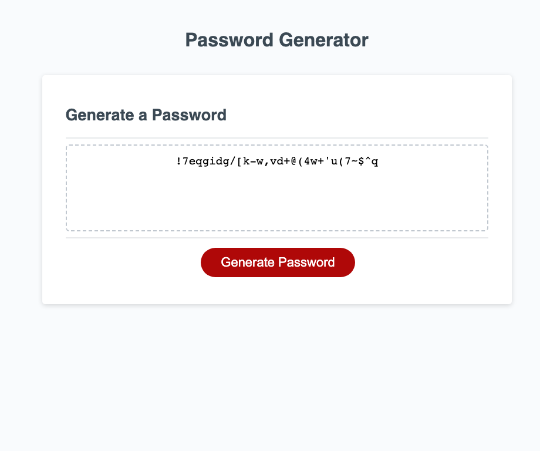

# Password generator tool

## Challenge requirements

An application must be established for the employee to generate a random password based on different criteria that the employee selects.

## Acceptance criteria

The instruction for the task were as follows:

* Generate a password when the button is clicked
  * Present a series of prompts for password criteria
  * Length of password
    * At least 10 characters but no more than 64
  * Character types
    * Lowercase
    * Uppercase
    * Numeric
    * Special Characters
* Code should validate for each input and at least one character type should be selected
* Once prompts are answered then the password should be generated and displayed in an alert or written to the page.

The project has been deployed on GitHub Page, link [here](https://phitrongtuanthanh.github.io/Password-generator-tool/).

## Usage

Visit the [page](https://phitrongtuanthanh.github.io/Password-generator-tool/), click 'Generate Password' button and follow the instructions.

## Screenshot

## License

Please refer to license in the Repo.